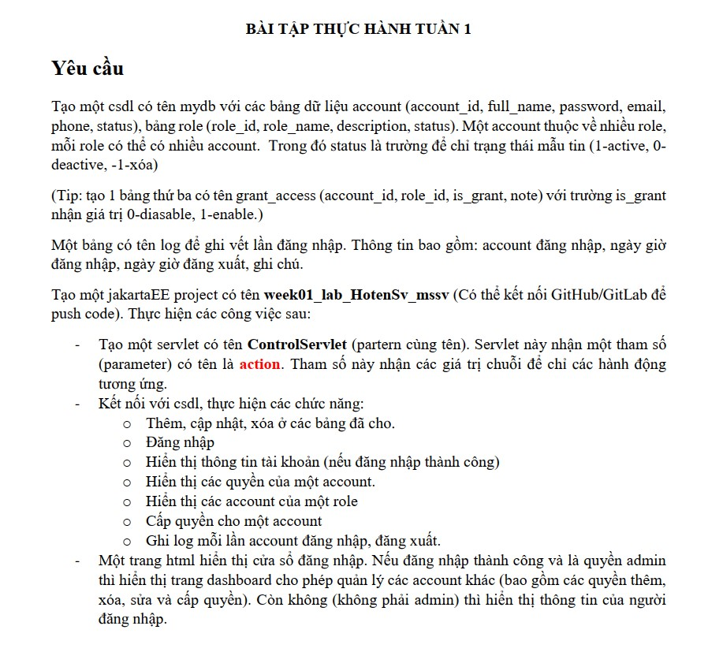
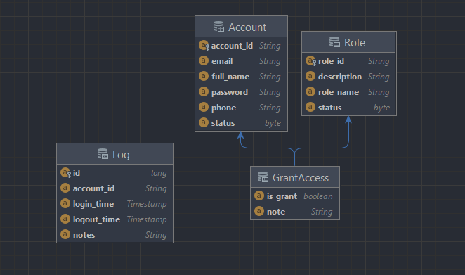
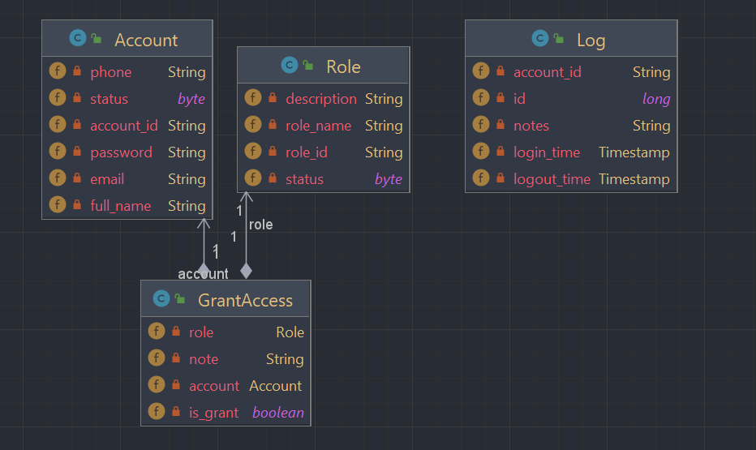
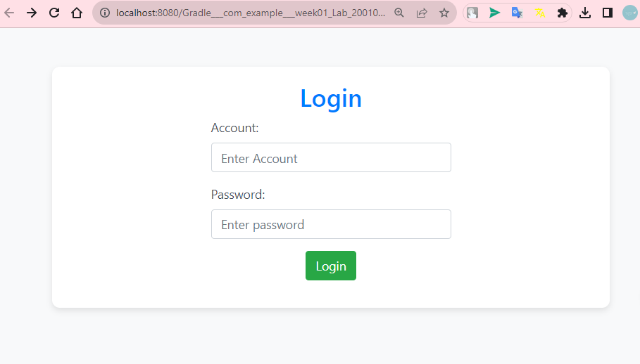
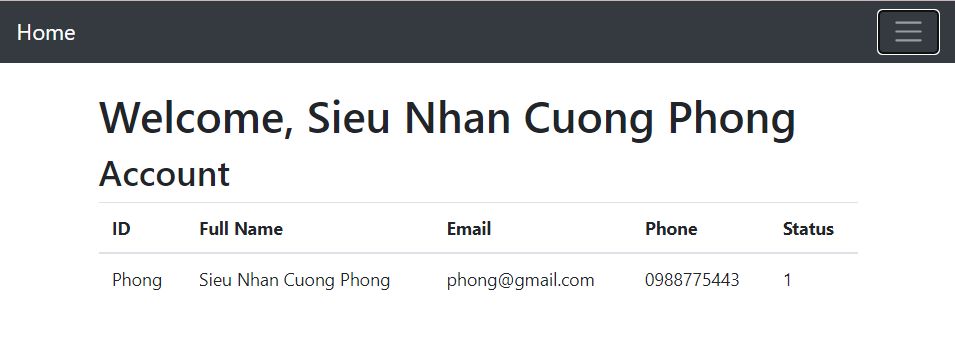
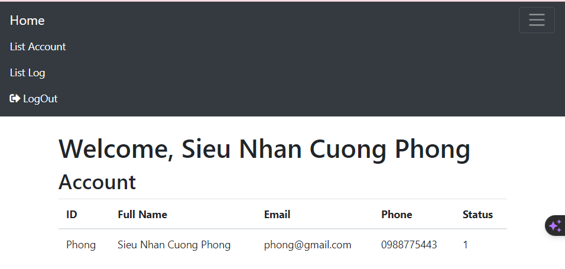
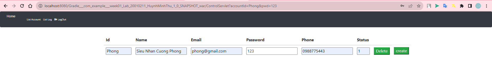
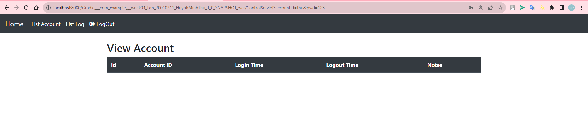
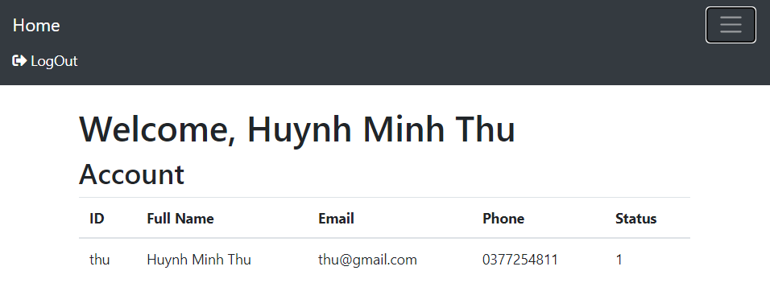

# week01_lab_HuynhMinhThu_20010211
# Bài tập thực hành tuần 01
- Huỳnh Minh Thủ
- Mssv: 20010211

# Yêu cầu đề bài:

# Hoạt động:
<h3> - Tạo Cơ sở dữ liệu gồm:</h3>

* account (account_id, full_name, password, email, phone, status)
* role (role_id, role_name, description, status)
* grant_access (account_id, role_id, is_grant, note)
* log để ghi vết lần đăng nhập, bao gồm: account đăng nhập, ngày giờ
  đăng nhập, ngày giờ đăng xuất, ghi chú.

<h3>
 - Entity Relationship Diagram:
<h3>

<h3>
 -  Class Diagram:
<h3>

<h3>
- Trang login (Account_id, password): 
</h3>

<h3>
- Login với tài khoản "admin", hiển thị thông tin tk sau khi đăng nhập
</h3>

<h3>
- Phân quyền cho tài khoản "admin"
</h3>

* "admin" bao gồm các quyền thêm, xóa, sửa và cấp quyền, hiển thị danh sách account, danh sách ghi log.  

<h3>
- View List Account, chức năng thêm, xóa của admin
</h3>

<h3>
- View List log
</h3>

<h3>
- Login với tài khoản "user", hiển thị thông tin tk sau khi đăng nhập
</h3>

