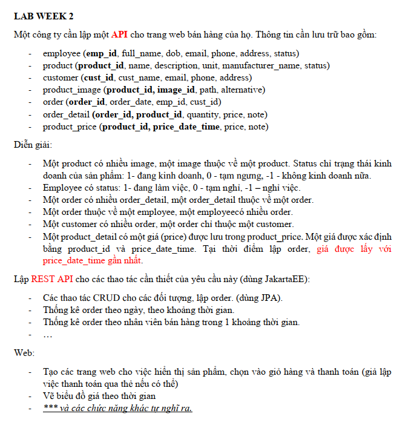
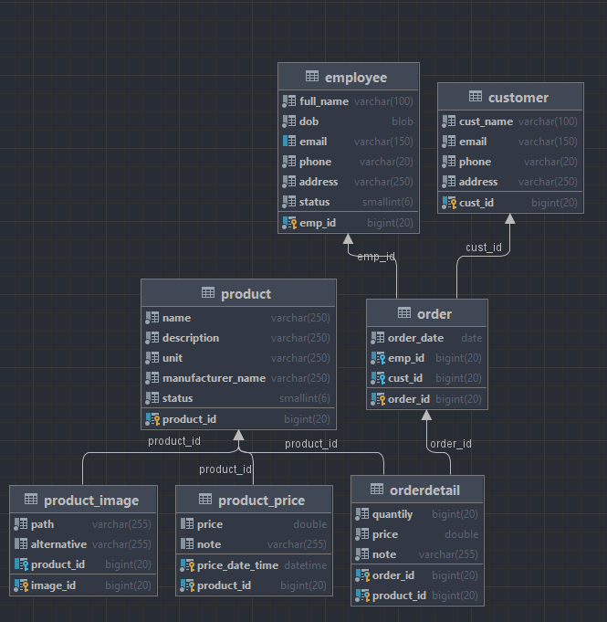
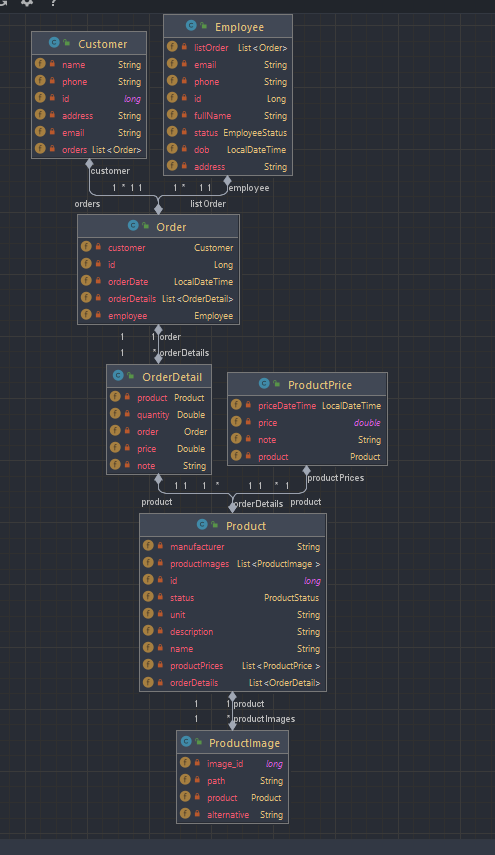

# week02_lab_HuynhMinhThu_20010211
# Bài tập thực hành tuần 02
- Huỳnh Minh Thủ
- Mssv: 20010211

# Yêu cầu đề bài:

# Hoạt động: 
## Entity Relationship Diagram:
- employee (emp_id, full_name, dob, email, phone, address, status)
- product (product_id, name, description, unit, manufacturer_name, status)
- customer (cust_id, cust_name, email, phone, address)
- product_image (product_id, image_id, path, alternative)
- order (order_id, order_date, emp_id, cust_id)
- order_detail (order_id, product_id, quantity, price, note)
- product_price (product_id, price_date_time, price, note)

## Class Diagram:

## Tạo trang thông tin Navigation menu

 

### Customer Listing ()
