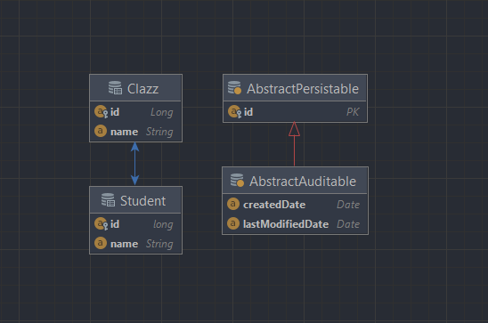
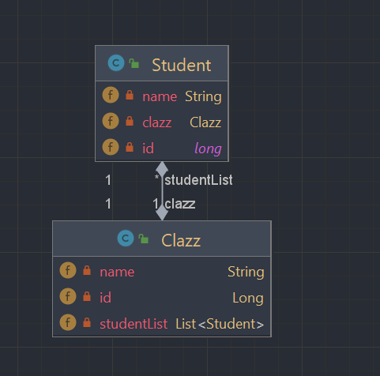
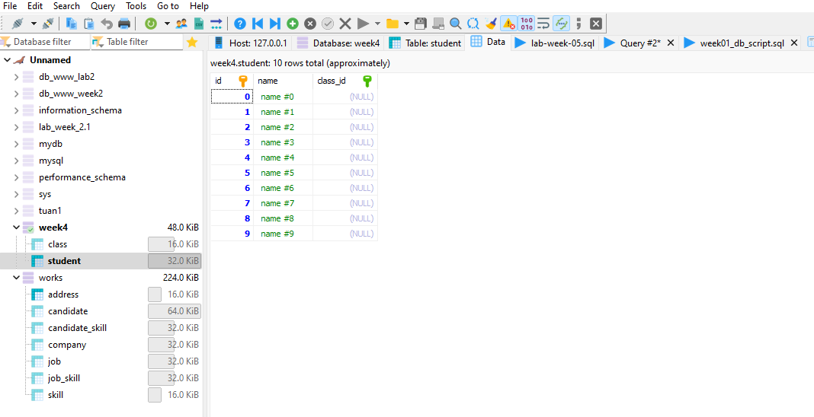

# week04_lab_HuynhMinhThu_20010211
# Bài tập thực hành tuần 04
- Huỳnh Minh Thủ
- Mssv: 20010211

# Yêu cầu đề bài:
- Làm quen với SpringBoot
- XML-Based Configuration

# Hoạt động:
- Ánh xạ dữ liệu vào database
## Entity Relationship Diagram:

## Class Diagram:

## Kết nối với database, tạo dữ liệu mẫu (test)

 
