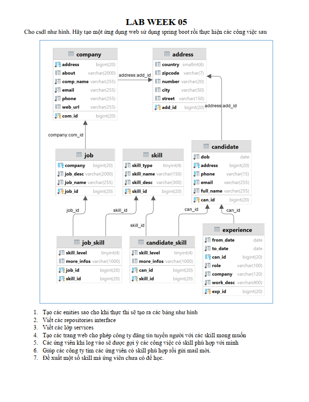
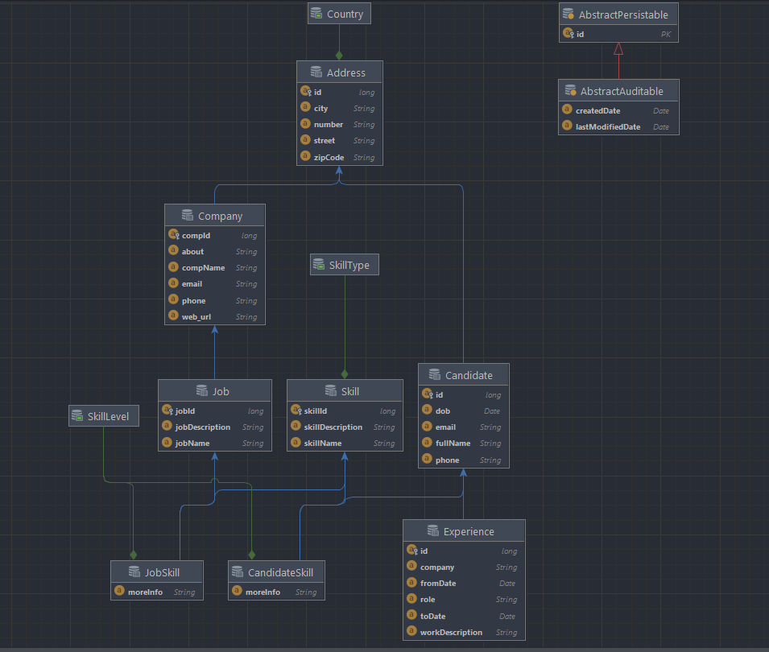
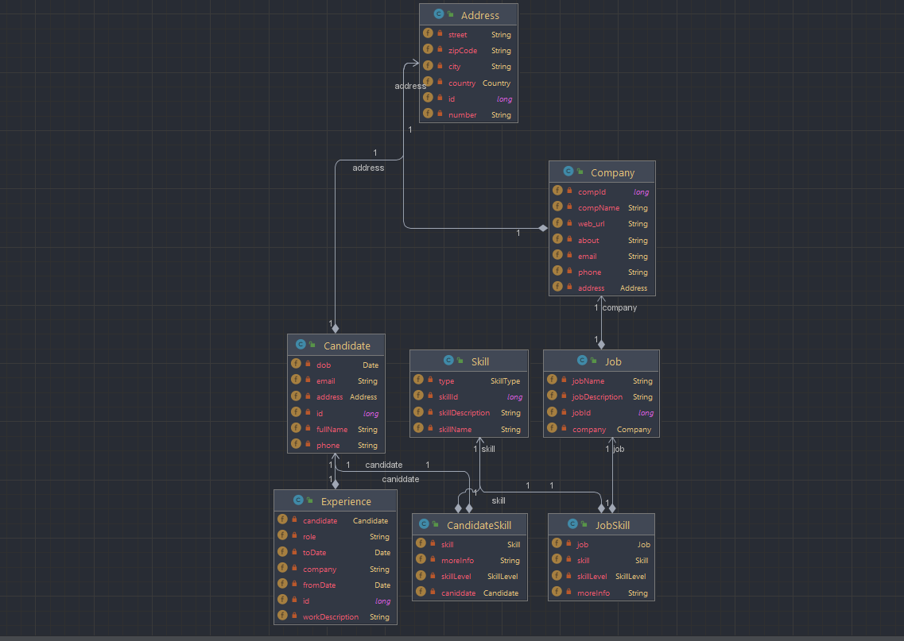

# www_lab_week05_huynhminhthu_20010211
# Bài tập thực hành tuần 05
- Huỳnh Minh Thủ
- Mssv: 20010211

# Yêu cầu đề bài:

# Hoạt động:
<h3> - Yêu cầu đề bài bao gồm:</h3>

1. Tạo các enities sao cho khi thực thi sẽ tạo ra các bảng như hình
2. Viết các repositories interface
3. Viết các lớp services
4. Tạo các trang web cho phép công ty đăng tin tuyển người với các skill mong muốn
5. Các ứng viên khi log vào sẽ được gợi ý các công việc có skill phù hợp với mình
6. Giúp các công ty tìm các ứng viên có skill phù hợp rồi gửi mail mời.
7. Đề xuất một số skill mà ứng viên chưa có để học

<h3>
 - Tạo Entity Relationship Diagram:
<h3>

<h3>
 -  Tạo Class Diagram:
<h3>

