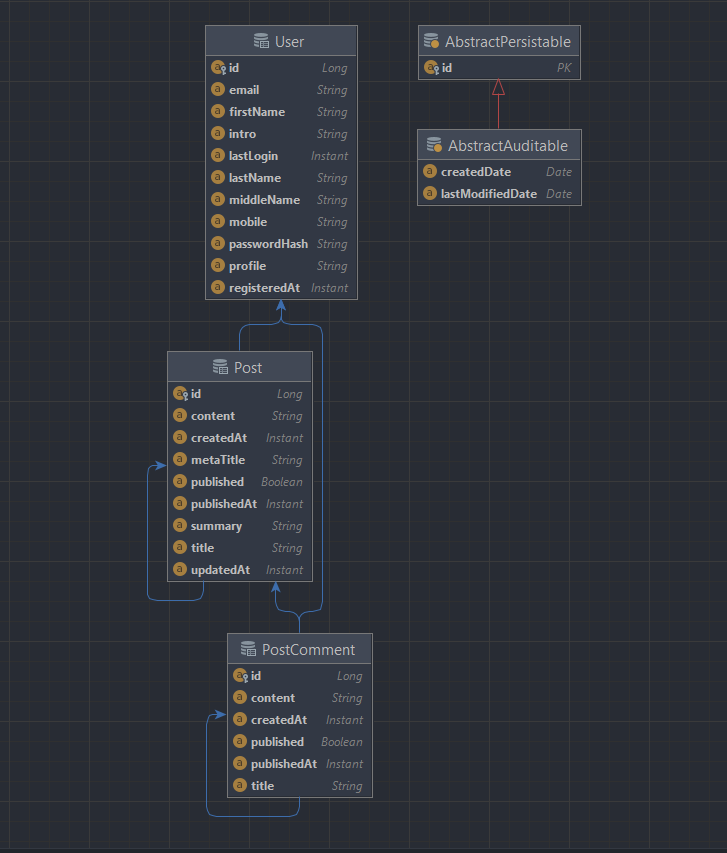

# www_lab_week05_huynhminhthu_20010211
# Bài tập thực hành tuần 05
- Huỳnh Minh Thủ
- Mssv: 20010211

# Yêu cầu đề bài:

# Hoạt động:
<h3> Ánh xạ dữ liệu:</h3>

<h3>
 - Tạo Entity Relationship Diagram:
<h3>

<h3>
 -  Tạo Class Diagram:
<h3>

