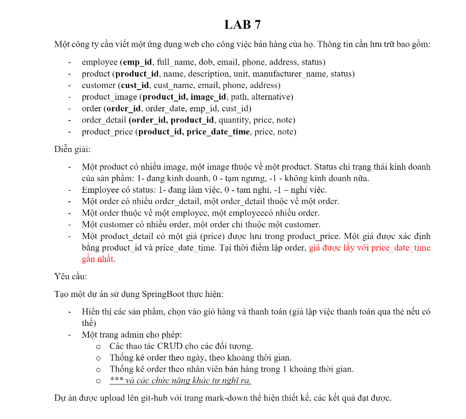
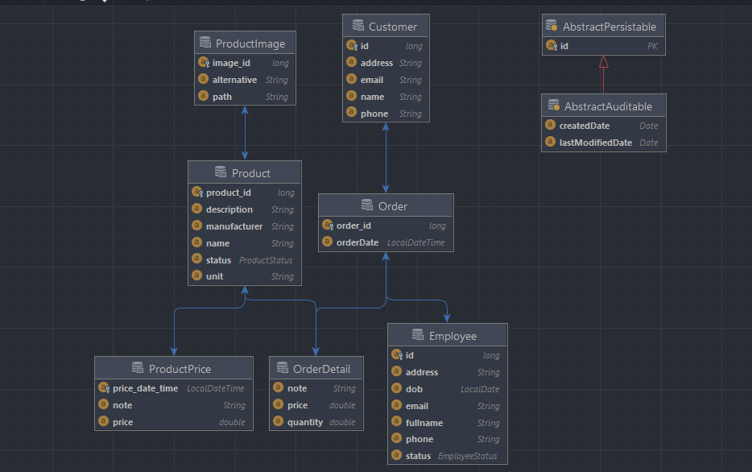
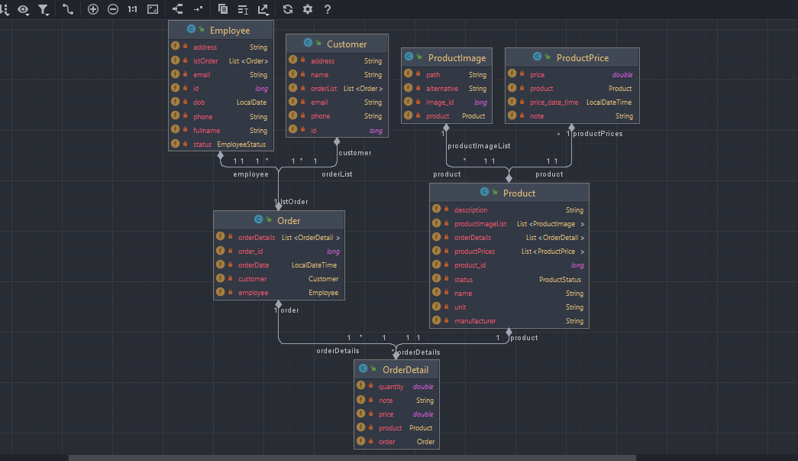
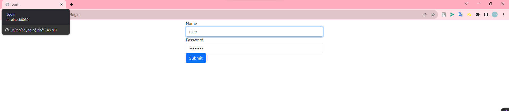
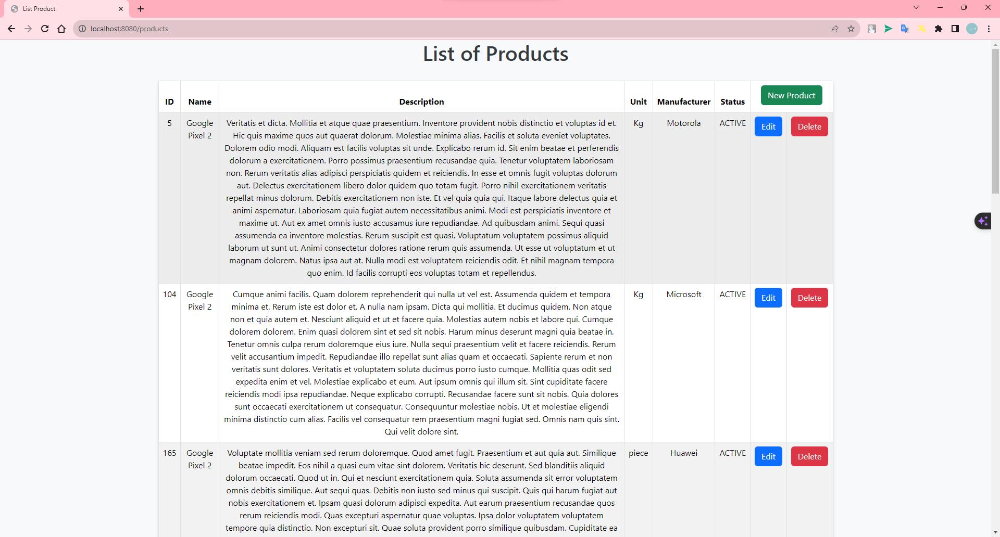
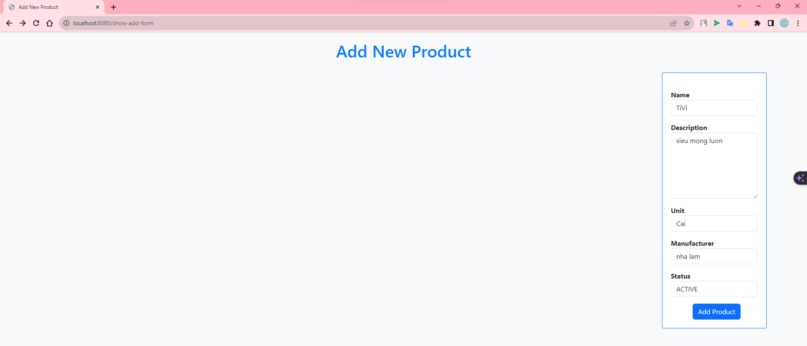

# www_week07_lab_20010211_HuynhMinhThu
# Bài tập thực hành tuần 07
- Huỳnh Minh Thủ
- Mssv: 20010211

# Yêu cầu đề bài:

# Hoạt động:
<h2> - Yêu cầu đề bài bao gồm:</h2>

#### Tạo một dự án sử dụng SpringBoot thực hiện:
##### - Hiển thị các sản phẩm, chọn vào giỏ hàng và thanh toán (giả lập việc thanh toán qua thẻ nếu có thể)
##### - Một trang admin cho phép:
  - Các thao tác CRUD cho các đối tượng.
  - Thống kê order theo ngày, theo khoảng thời gian.
  - Thống kê order theo nhân viên bán hàng trong 1 khoảng thời gian.
  - *** và các chức năng khác tự nghĩ ra.

<h3>
 - Tạo Entity Relationship Diagram:
</h3>

- employee (emp_id, full_name, dob, email, phone, address, status)
- product (product_id, name, description, unit, manufacturer_name, status)
- customer (cust_id, cust_name, email, phone, address)
- product_image (product_id, image_id, path, alternative)
- order (order_id, order_date, emp_id, cust_id)
- order_detail (order_id, product_id, quantity, price, note)
- product_price (product_id, price_date_time, price, note)

<h3>
 -  Tạo Class Diagram:
<h3>

<h3>
 - Trang Login với User and password:
</h3>

<h3>
 - Trang List product:
</h3>

##### Các dữ liệu hiển thị trong list product bao gồm:

- id
- productName
- description
- unit
- manufacturer
- status

<h3>
 - Trang Add product:
</h3>

##### Các dữ liệu thêm vào product bao gồm:
- productName 
- description
- unit
- manufacturer
- status

